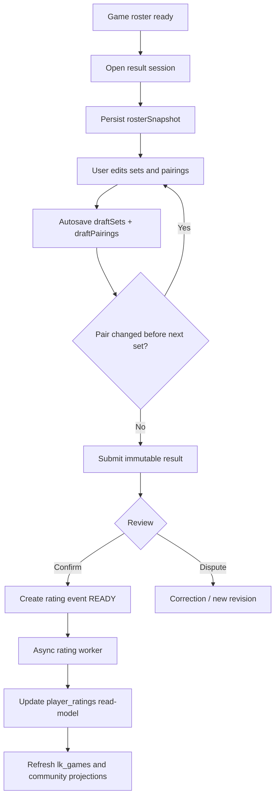

# LK Games — архитектурное ТЗ на механику ввода результата и рейтинга

## 1. Контекст и проблема

Текущий контур `POST /lk/games/:gameId/result/submit` делает слишком много в одном синхронном запросе:

1. реконструирует составы эвристиками из `participants`, `waitlist`, `teamSlots`, `metadata`, `playerPool`;
2. читает `player_ratings` в горячем command-path;
3. сразу пишет `lk_game_results`, `lk_games`, `player_ratings`, `lk_game_rating_events`;
4. не имеет стабильного server-side draft для экрана ввода результата.

Это порождает три класса проблем:

- экран ввода результата сбрасывается, потому что draft живёт локально и частично в generic metadata;
- submit может зависать, потому что write-path зависит от read-model `player_ratings`;
- при смене пар между сетами результат и рейтинг остаются хрупкими, потому что backend восстанавливает составы по косвенным данным.

## 2. Цель

Сделать ввод результата устойчивым, детерминированным и разложенным по слоям:

- **draft/session** хранится на сервере и восстанавливается после reopen/reload;
- **result aggregate** сохраняется как immutable факт матча;
- **rating** считается только из подтверждённого результата отдельным downstream-процессом;
- **смена пар по сетам** является штатным сценарием и хранится явно.

## 3. Не-цели первого этапа

- Не переписываем весь community-rating слой за один релиз.
- Не ломаем существующие `confirm/dispute/expire` API, пока frontend не переведён.
- Не делаем миграцию старых данных в рамках первого backend-среза, кроме точечных repair-скриптов.

## 4. Каноническая модель

### 4.1 Сущности

| Сущность | Роль | Канонические поля |
| --- | --- | --- |
| `lk_games` | coarse read model игры | `resultStatus`, `resultLifecycleState`, `latestResultId`, `resultContextSummary` |
| `lk_game_result_sessions` | server-side draft/autosave | `id`, `gameId`, `rosterSnapshot`, `draftSets`, `draftPairings`, `revision`, `openedBy`, `lastTouchedBy` |
| `lk_game_results` | immutable submitted/confirmed result | `id`, `gameId`, `rosterSnapshot`, `sets`, `effectiveSetPairings`, `submittedBy`, `status`, `revisionOf` |
| `lk_game_rating_events` | outbox и аудит рейтинга | `id`, `resultId`, `status`, `ratingFacts`, `appliedAt`, `revertedAt` |
| `player_ratings` | read-model | `phoneNorm`, `ratingNumeric`, `rating`, `lastResultId` |

### 4.2 Главные принципы

1. `player_ratings` не участвует в горячем submit-path как обязательная зависимость.
2. `rosterSnapshot` сохраняется до submit и дальше не мутирует.
3. Пары могут меняться между сетами; канонический результат хранит `effectiveSetPairings[]`.
4. Результат матча — отдельный aggregate, а не побочный эффект документа игры.

## 5. Жизненный цикл и что сохраняем на каждом этапе

| Этап | Endpoint / процесс | Что сохраняем | Что передаём дальше |
| --- | --- | --- | --- |
| 1. Roster lock | backend при открытии ввода результата | `rosterSnapshot.playerPool`, `initialTeamSlots`, `allowedPhoneNorms`, `booking/date` | `sessionId`, `rosterSnapshot`, `revision` |
| 2. Session open | `POST /lk/games/:gameId/result/session/open` | `lk_game_result_sessions` c draft-state | `sessionId`, `draftSets`, `draftPairings`, `rosterSnapshot` |
| 3. Autosave draft | `PATCH /lk/games/:gameId/result/session/:sessionId` | `draftSets`, `draftPairings`, `attachments`, `revision+1` | актуальный draft для UI |
| 4. Submit result | `POST /lk/games/:gameId/result/submit` | immutable `lk_game_results` в `PENDING_REVIEW` | `resultId`, `status`, `sourceSessionId` |
| 5. Confirm / dispute | `confirm`, `dispute`, `accept-correction`, `expire` | lifecycle результата и correction context | событие для rating worker |
| 6. Rating apply | async worker/outbox | `lk_game_rating_events`, projection update | новые read-models |
| 7. Projection refresh | async | `lk_games`, community facts, audit | UI/read APIs |

## 6. Целевая структура данных

### 6.1 `lk_game_result_sessions`

```json
{
  "_id": "result_session_<gameId>",
  "id": "result_session_<gameId>",
  "gameId": "pay_...",
  "status": "ACTIVE",
  "rosterSnapshot": {
    "capturedAt": "2026-06-03T12:00:00.000Z",
    "capturedAtTs": 1780488000000,
    "playerPool": [],
    "initialTeamSlots": [],
    "allowedPhoneNorms": [],
    "booking": {
      "date": "2026-06-03",
      "timeFrom": "19:00",
      "timeTo": "20:30",
      "vivaExerciseId": "..."
    }
  },
  "draftSets": [],
  "draftPairings": [],
  "attachments": [],
  "revision": 1,
  "openedBy": { "phoneNorm": "79..." },
  "lastTouchedBy": { "phoneNorm": "79..." },
  "createdAt": "2026-06-03T12:00:00.000Z",
  "updatedAt": "2026-06-03T12:00:00.000Z",
  "deleted": false
}
```

### 6.2 `lk_game_results`

```json
{
  "_id": "res_...",
  "gameId": "pay_...",
  "status": "PENDING_REVIEW",
  "sourceSessionId": "result_session_<gameId>",
  "sourceSessionRevision": 7,
  "rosterSnapshot": {},
  "sets": [
    { "left": 6, "right": 4 }
  ],
  "effectiveSetPairings": [
    { "setIndex": 0, "teamSlots": [] }
  ],
  "submittedBy": { "phoneNorm": "79..." }
}
```

## 7. API-контракт

### 7.1 Session open

`POST /lk/games/:gameId/result/session/open`

Request:

```json
{
  "phone": "7910...",
  "submittedBy": { "id": "...", "name": "...", "phone": "7910..." }
}
```

Response:

```json
{
  "gameId": "pay_...",
  "sessionId": "result_session_pay_...",
  "status": "ACTIVE",
  "revision": 1,
  "isRestored": false,
  "rosterSnapshot": {},
  "draftSets": [],
  "draftPairings": []
}
```

### 7.2 Session autosave

`PATCH /lk/games/:gameId/result/session/:sessionId`

Request:

```json
{
  "phone": "7910...",
  "revision": 1,
  "draftSets": [
    { "left": 6, "right": 4 }
  ],
  "draftPairings": [
    {
      "setIndex": 0,
      "teamSlots": [{ "id": "p1" }, { "id": "p2" }, { "id": "p3" }, { "id": "p4" }]
    }
  ]
}
```

Response:

```json
{
  "gameId": "pay_...",
  "sessionId": "result_session_pay_...",
  "status": "ACTIVE",
  "revision": 2,
  "draftSets": [],
  "draftPairings": [],
  "lastTouchedAt": "2026-06-03T12:05:00.000Z"
}
```

### 7.3 Result submit

До полного перевода фронта сохраняем совместимость с текущим `POST /result/submit`, но payload должен уметь нести:

```json
{
  "phone": "7910...",
  "sessionId": "result_session_pay_...",
  "sessionRevision": 7,
  "sets": [],
  "setPairings": []
}
```

На следующем этапе backend должен использовать `sessionId` как канонический источник `rosterSnapshot/effectiveSetPairings`.

## 8. Блок-схема процесса



## 9. Рабочие пакеты по командам

### 9.1 Architect / Planner

Задачи:

1. Зафиксировать ADR по разделению `session / result / rating projection`.
2. Подтвердить lifecycle и совместимость старых endpoint-ов.
3. Утвердить rollout и rollback.

Артефакты:

- это ТЗ;
- ADR по result aggregate;
- acceptance criteria для rollout.

### 9.2 Backend Feature Implementer

Задачи:

1. Ввести `lk_game_result_sessions`.
2. Добавить `open` и `patch` session endpoints в Node-RED.
3. На submit научить backend принимать `sessionId/sessionRevision`.
4. На следующем этапе вынести rating apply из sync-submit в async worker.

Acceptance criteria:

- reopen экрана возвращает тот же draft;
- draft не теряется при reload;
- пары по сетам сохраняются и восстанавливаются;
- submit больше не зависит от клиентской metadata для восстановления draft.

### 9.3 Frontend Feature Implementer

Задачи:

1. При открытии формы вызывать `session/open`.
2. Хранить локальный state как кеш поверх server-side draft, а не как единственный источник истины.
3. По изменению сетов/пар выполнять debounce-autosave.
4. При reopen/reload гидрировать форму из `rosterSnapshot + draftSets + draftPairings`.

Acceptance criteria:

- экран не сбрасывается после ввода;
- смена пары перед сетом N восстанавливается после reopen;
- submit использует `sessionId` и актуальную `revision`.

### 9.4 Test Engineer

Задачи:

1. Добавить исполняемые Node-RED tests на session lifecycle.
2. Зафиксировать инварианты по pairings-per-set.
3. Добавить тесты на optimistic concurrency по `revision`.
4. На следующем этапе — тесты на async rating apply и idempotency.

Acceptance criteria:

- есть тест на open new session;
- есть тест на restore existing session;
- есть тест на смену пары между сетами;
- есть тест на revision conflict.

### 9.5 Reviewer / Critic

Задачи:

1. Проверить, что новый session-layer не протаскивает generic `metadata.teamSlots` как source of truth.
2. Проверить, что `player_ratings` не стал ещё сильнее связан с submit-path.
3. Проверить rollout-риск для prod/dev bundles и Node-RED imports.

## 10. Поэтапный rollout

### Этап A — уже запускаем сейчас

- ТЗ и acceptance criteria.
- Server-side `result session` для stable draft/autosave.
- API-контракт для frontend.
- Исполняемые regression tests.

### Этап B

- Frontend перевод `GamesPage.tsx` на `session/open + autosave`.
- Submit с `sessionId/sessionRevision`.
- Снятие зависимости экрана от generic metadata draft.

### Этап C

- Async rating worker.
- `submit` сохраняет immutable result без sync-update `player_ratings`.
- confirm/dispute работают через rating event outbox.

### Этап D

- Migration/backfill старых result docs.
- Repair stale provisional rating events.
- Cleanup старой эвристической reconstruction-логики.

## 11. Наблюдаемость и контроль

Нужно добавить и контролировать:

- latency `result/session/open`;
- latency `result/session/:id PATCH`;
- count `revision_conflict`;
- count `session_restore`;
- count `submit_without_session`;
- queue lag для rating worker;
- count `rating_event_failed`.

## 12. Минимальный набор тестов

1. `open session creates snapshot for a participant`
2. `open session restores existing draft without snapshot drift`
3. `patch session saves pairings for a specific set`
4. `patch session rejects stale revision`
5. `submit stores sourceSessionId/sourceSessionRevision`
6. `pairings may differ between set 1 and set 3 without overwriting previous set`

## 13. Решения по спорным местам

### 13.1 Почему не хранить draft только на фронте

Потому что это не переживает reload, reopen, race между окнами и серверные side effects.

### 13.2 Почему не считать рейтинг сразу в submit

Потому что submit — command-path. Рейтинг — projection. Их смешение уже привело к зависаниям и хрупкости.

### 13.3 Почему snapshot обязателен

Потому что составы и пары могут меняться по сетам, а значит итог должен считаться из зафиксированного match-context, а не из поздней реконструкции по живым коллекциям.
